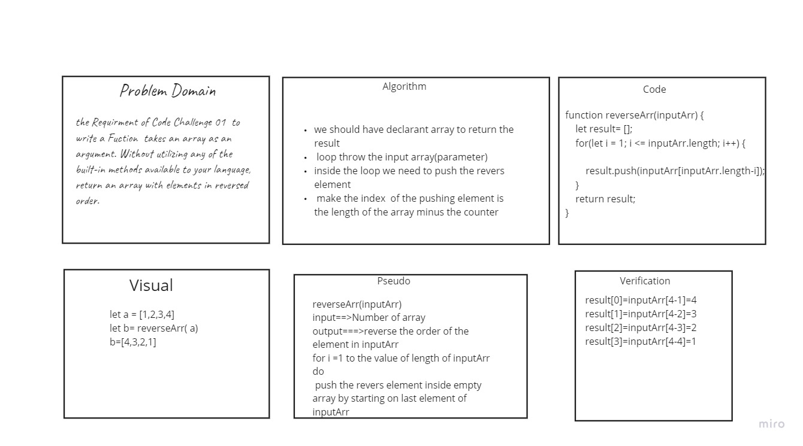

# Challenge Summary
Without utilizing any of the built-in methods available to your language, return an array with elements in reversed order.

# Challenge Description
loop throw the input array then start pushing the element from back to starting index by Subtract the length of each itreation 
# Approach & Efficiency
it's Efficient to reverse any array

# Solution

* Whitboard
