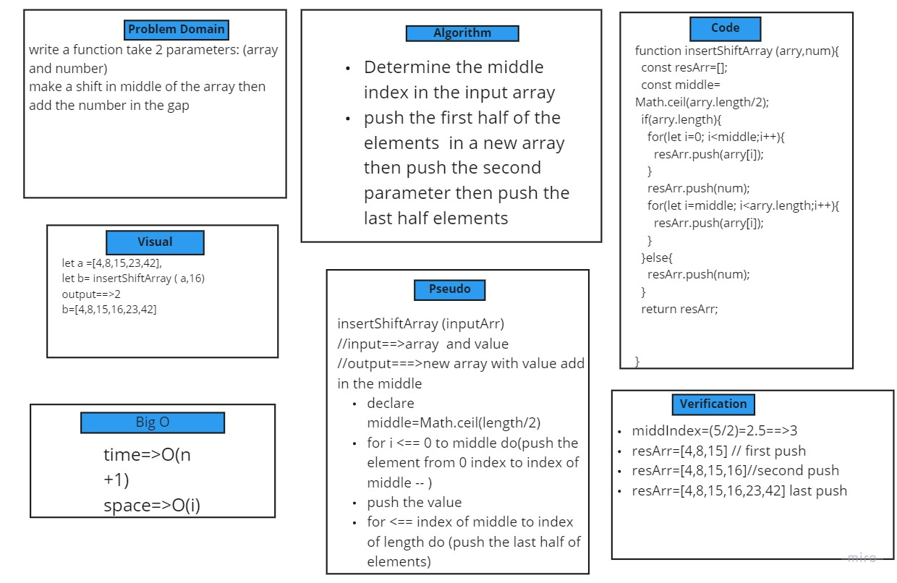

# Challenge Summary
we need function takes in an array and the value to be added at the middle index, then return the new ordered array

## Challenge Description
* I specified the the middle index by math.ceil  to make sure where we should add the element 
* push the first half of the elements  in a new array then push the second parameter then push the last half elements

## Approach & Efficiency
this Approach is Efficient to add any value in middle of array index whether the length odd or even or the array is empty 

## Solution
* Whiteboard  